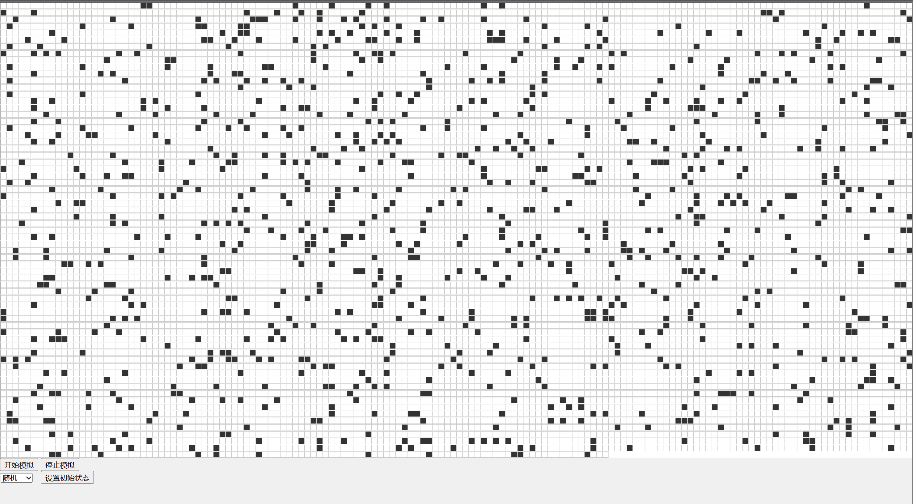

# GameOfLife
site entry： [GameOfLife](https://zerotoone1.github.io/GameOfLife/)
## introduce

Game of Life is a computer program designed by John Horton Conway of the University of Cambridge.

Martin Gardner (1914-2010), an American master of fun mathematics, introduced Conway's life game to a wide range of violators outside the academic community through the magazine "Scientific American", which attracted a large number of people from all walks of life. At this time, the topic of cellular automata attracted the attention of scientists.

## profile

Life games do not involve competition among players, nor can they be considered a win or loss game. They can be classified as simulation games. In fact, it is also named "Life Game" because the images it simulates and displays look similar to the birth and reproduction process of life. During the game, disorderly cells will gradually evolve into various exquisite and tangible structures; These structures often have good symmetry, and each generation changes shape. Some shapes will not change from generation to generation once locked. Sometimes, some already formed structures are destroyed due to the "invasion" of disordered cells. But shape and order often emerge from chaos.

      
Each square can accommodate one living cell, and each living cell has only two states:
      

Live or die. Use black squares to indicate that the cell is "alive", and white spaces (white) to indicate that the cell is "dead". Or, in other words, the black part in the grid represents the distribution map of a certain "life" at a certain time. What life games want to simulate is how this distribution map will change from generation to generation over time.

## rule

At the beginning of the game, each cell is randomly set to a certain state of either "birth" or "death". Then, according to a certain rule, calculate the state of each cell in the next generation and draw a life and death distribution map of the next generation of cells.
      
What iteration rules should be specified? We need a simple survival law that reflects both synergy and competition among lives. For simplicity's sake, the most basic consideration is to assume that every cell follows exactly the same survival law; Furthermore, the interaction between cells is limited to the 8 neighbors closest to the cell.
      
That is to say, the state of each cell after iteration is determined by the state of that cell and the surrounding 8 cells. Despite these limitations, there are still many ways to specify the specific details of the 'law of survival'. For example, in Conway's life game, the following survival laws were established.

1. When the current cell is in a dead state and there are 3 living cells around it, the cell becomes in a live state after iteration (simulating reproduction); If it was originally a living, it remains unchanged.
2. When the current cell is in a living state, when less than two neighboring cells (excluding two) survive, the cell becomes in a dead state (simulating a sparse number of life).
3. When the current cell is in a living state, when there are two or three living cells around it, the cell remains intact.
4. When the current cell is in a living state, when there are more than three living cells around it, the cell becomes in a dead state (simulating an excessive number of life).

The initial cell structure can be defined as seeds, and when all seed cells are processed according to the above rules, the first generation cell diagram can be obtained. Continuing to process the current cell diagram according to the rules can result in the next generation of cell diagrams, repeating the process.

The above survival laws can of course be arbitrarily modified to create different 'life games'.

## display

_______

